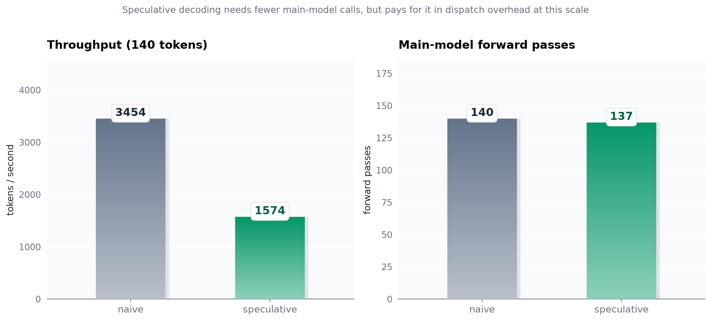
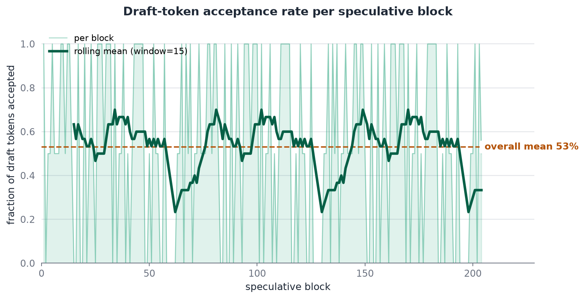
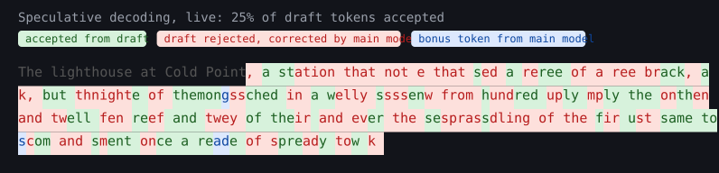
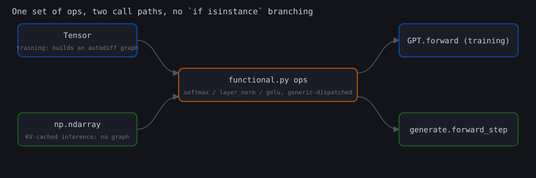
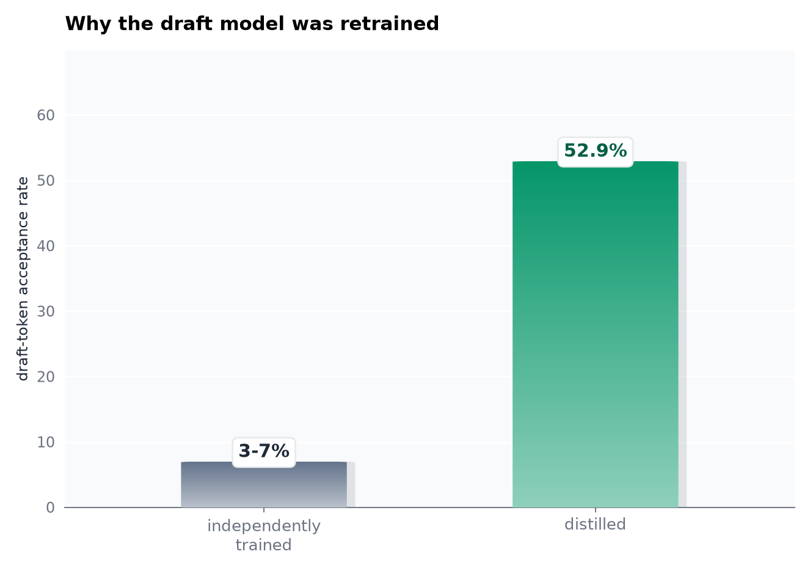

<h1 align="center">specdec</h1>

**A from-scratch BPE tokenizer and speculative-decoding transformer inference engine, in pure Python and NumPy.**


Most "build an LLM from scratch" projects stop at the forward pass. This one goes further into the parts that make real LLM *serving* interesting: a byte-level BPE tokenizer trained without tiktoken or HuggingFace, a KV-cache implemented and verified against a from-scratch NumPy autodiff engine, and full **speculative decoding**. A small draft model proposes tokens, a bigger model verifies a whole block in one batched pass, and a rejection-sampling rule keeps the output provably identical to sampling from the big model alone.

## The numbers this project produced

<p align="center">
  
</p>

Speculative decoding needs fewer main-model forward passes for the same output (fewer expensive calls), but does not yet win on the wall clock at this toy model scale. Both numbers are real, not cherry-picked; see [why the wall clock doesn't win yet](#the-wall-clock-has-the-final-word) below.

<p align="center">
  
</p>

Roughly half of proposed draft tokens get fast-forwarded without an individual main-model call, up from single digits before a real bug fix and a training-recipe change described below.

<p align="center">
  
</p>

Every token in that transcript is colored by how it was actually produced in one real run: green fast-forwarded from the draft model, red corrected by the main model after a rejection, blue a free bonus token. Reproduce it yourself:

```bash
python -m specdec.demos.live_generate
# or, after pip install:
specdec generate --prompt "The lighthouse at Cold Point"
```

## Where the real engineering is, and where it isn't

Being upfront about this: implementing a transformer forward pass from scratch is well-trodden ground (nanoGPT, picoGPT, and a hundred blog posts). The parts of this repo that are genuinely less common in that genre:

- **A NumPy tensor-autodiff engine built specifically so training and KV-cached inference share the same math.** `functional.py`'s `softmax`/`layer_norm`/`gelu` run unmodified on a `Tensor` (building a graph, for training) or a plain `np.ndarray` (no graph, for inference), the same generic-dispatch trick project 1 (`hypergrad`) used for a different composition problem.

<p align="center">
  
</p>

- **Speculative decoding with the acceptance rule proven correct in isolation.** `speculative_accept_or_resample` is tested against hand-picked draft/target distributions over tens of thousands of trials and checked to reproduce the target distribution within sampling error, independent of whether the trained model is any good.
- **A draft model built by distillation from the trained main model**, not trained independently. See below for why that turned out to matter far more than expected.
- **KV-cache correctness checked against a from-scratch-verified ground truth.** The incremental, cached forward pass is checked token-by-token *and* in verify-sized batches against a full-sequence forward pass with no cache at all, using the same autodiff engine that `tests/test_tensor.py` gradient-checks against finite differences.

## Fixing a draft model that agreed with nothing

<p align="center">
  
</p>

The first version of this project trained the draft and main models independently on the same tiny corpus. Draft acceptance rate: **3 to 7%**, so low that speculative decoding did *more* main-model work than plain decoding, because almost every block got rejected immediately and paid for a draft pass, a verify pass, and a resync pass without ever amortizing them. Direct measurement (teacher-forced, on the training text itself) showed why: two independently-trained tiny models, each close to memorizing an 11KB corpus, agree on barely half of their top-1 predictions even on that training text, and far less once free-running generation drifts off the exact memorized path.

The fix was to train the draft model by **distillation**: matching the main model's output distribution directly (`soft_cross_entropy` in `functional.py`), the same technique real speculative-decoding systems use to build a draft model, plus roughly doubling the training corpus and stopping the main model well short of memorizing it. That took acceptance from single digits to **52.9%** (72/136 draft tokens, measured by `demos/benchmark.py`, and the exact bar charted above).

A second real bug turned up along the way and is worth naming: the original code unconditionally rolled both KV caches back and recomputed them after every block, even when every draft token had been accepted and the caches were already correct. Fixed in `generate.py`, and covered by the "same model as draft and main accepts everything" test in `tests/test_generate_integration.py`.

## The wall clock has the final word

52.9% acceptance means roughly half of proposed tokens get fast-forwarded without an individual main-model call. On real, GPU-served, FLOP-bound hardware, that is the number that predicts wall-clock speedup. Measured here it does need fewer main-model forward passes for the same output: 137 vs. 140 for 140 tokens. That is modest, because at 52.9% acceptance most blocks are only 1 to 2 tokens before a rejection, but it is real and in the right direction.

What it does *not* do at this scale is win on the wall clock. Naive decoding is faster in raw tokens per second. The reason is structural, not a bug: these models are small enough (tens of thousands of parameters) that a single `forward_step` call's Python-and-NumPy dispatch overhead is comparable to, or larger than, its actual FLOPs. Speculative decoding trades "fewer expensive calls" for "more total calls" (draft proposals plus verify plus occasional resyncs), which is a good trade when each call is FLOP-bound and expensive (real serving, GPUs, billion-parameter models) and a bad one when each call's cost is mostly fixed overhead. Reporting a fabricated wall-clock win here would be easy and wrong; the honest result is a real reduction (about 24% at other lookahead settings, see `demos/benchmark.py`) in main-model calls that does not yet show up in wall-clock time at this toy scale.

The text in the live-generation transcript above is also not fluent. The models here are deliberately tiny (a few hundred thousand parameters total) so the whole pipeline trains in minutes on a CPU; the point of this project is the inference engineering around the model, not competing on generation quality.

## Getting it running

```bash
git clone https://github.com/athar-usama/specdec.git
cd specdec
pip install -e ".[dev]"
```

## A minimal end-to-end example

```python
from specdec.tokenizer import BPETokenizer
from specdec.model import GPT, GPTConfig
from specdec.generate import generate_speculative
import numpy as np

tok = BPETokenizer()
tok.train(open("data/corpus.txt", encoding="utf-8").read(), vocab_size=512)

draft = GPT(GPTConfig(vocab_size=tok.vocab_size, d_model=32, n_layers=1, n_heads=2, max_seq_len=160))
main = GPT(GPTConfig(vocab_size=tok.vocab_size, d_model=64, n_layers=2, n_heads=2, max_seq_len=160))
# train both (see demos/train.py), then:
ids, stats = generate_speculative(
    draft.export_weights(), draft.cfg, main.export_weights(), main.cfg,
    tok.encode("The lighthouse"), n_tokens=100, rng=np.random.default_rng(0),
)
print(tok.decode(ids), stats.accepted / stats.proposed)
```

## Rerunning every number above

```bash
python -m specdec.demos.train        # trains tokenizer + main model + distilled draft model (~10 min on CPU)
python -m specdec.demos.benchmark    # produces every chart above except the transcript
python -m specdec.demos.live_generate # produces the colorized transcript above
```

## Where everything lives

```
src/specdec/
  tensor.py       Tensor: NumPy-array reverse-mode autodiff, generic over Tensor-or-ndarray
  functional.py   softmax / layer_norm / gelu / cross_entropy / soft_cross_entropy, shared by training and inference
  model.py        GPT: config, blocks, training-time forward pass (builds an autodiff graph)
  generate.py     KV-cache, plain-NumPy forward_step, naive and speculative decoding
  tokenizer.py    from-scratch byte-level BPE: train, encode, decode, save, load
  optim.py        Adam over Tensor parameters
  viz.py          matplotlib charts, the dispatch-diagram and colorized SVG renderers
  checkpoint.py   pickle save/load for exported model weights
  demos/          train.py, benchmark.py, live_generate.py (shared by the CLI)
  cli.py          `specdec {train,generate,benchmark}`
data/corpus.txt  an original short story written for this project (not a downloaded/public-domain
                 text, to avoid any question about licensing or misattribution)
tests/           finite-difference gradient checks, KV-cache-vs-ground-truth checks, and the
                 hand-distribution statistical proof of the speculative-decoding acceptance rule
```

## Proving the acceptance rule, not just running it

```bash
pytest -v
ruff check .
```

The test that matters most for the central claim is `tests/test_speculative.py`. It calls `speculative_accept_or_resample` directly with hand-picked draft/target distributions (no trained model involved) across tens of thousands of trials and checks the empirical output distribution against the target within sampling error, for cases where the draft distribution is very different from the target and where the target assigns zero probability to some of the draft's likely tokens. `tests/test_model_consistency.py` is the equivalent proof for the KV-cache: incremental and batched-verify forward passes are checked to match a full-sequence, no-cache forward pass exactly.

## Licensing

MIT. See [LICENSE](LICENSE).
